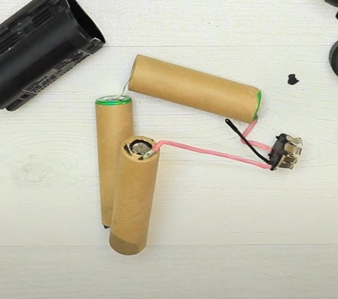
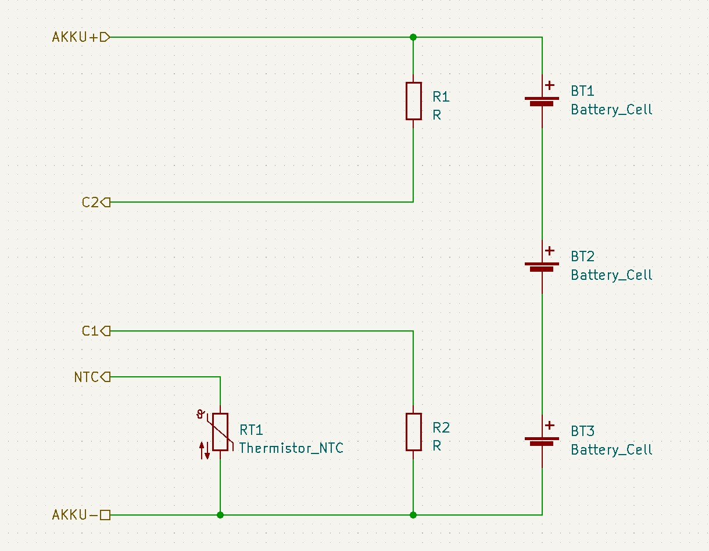

# Dremel-PCB1857V1

Reverse engineering of a Dremel 12v battery charger.
The pcb has the markings: PCB1857V1
This repository contains KiCad schematics of the main side of its power supply.
Some component values have been measured and added.

## Battery

It is an open secret that Bosch and Dremel (Dremel being a division in the Robert Bosch Tool Corporation since 1993) batteries are compatible except for the bottom plastic shell with the retainment clips. If I had to take a wild guess I would say they are probably even manufactured in the same factory.

Even though the battery exposes two contacts for balance charging labeled C1 and C2 only C1 is connected to the charger. 

The kicker however is that inside the Bosch GSR BAT411 the both C1 and C2 are not actually connected to the batteries, as you can clearly see in the picture below:

  
Source: [BOSCH Upgrade Battery / Change Old Dead Li Ion Cell / GSR BAT411 - CMC DIY (youtube)](https://www.youtube.com/watch?v=-DkphFzir5k)

From what I could gather from some pictures online the internal connections look like this:

  

### Why is this a problem?  

The connections to the individual battery cells are required for balance charging.
Due to manufacturing variations the internal resistance $R_1$, $R_2$ of two cells can vary. When the battery is discharged a current $I$ is flowing through all cells equally due to Kirchhoff's current law. This causes the voltages of the individual cells to decrease according to  

$$
\begin{align*}
    U_1 = R_1 \cdot I  \\
    U_2 = R_2 \cdot I
\end{align*}
$$

Resulting in a voltage difference of  

$$
\begin{align*}
    \Delta U = U_1 - U_2 
\end{align*}
$$

When the battery gets charged again this difference would get annihilated if the resistances were constant, but they are not. Over many discharge/charging cycles$\Delta U$ can grow to be substantial difference which could cause the battery to fail because:  
a) One cell get under discharged, or  
b) the other cell gets overcharged.