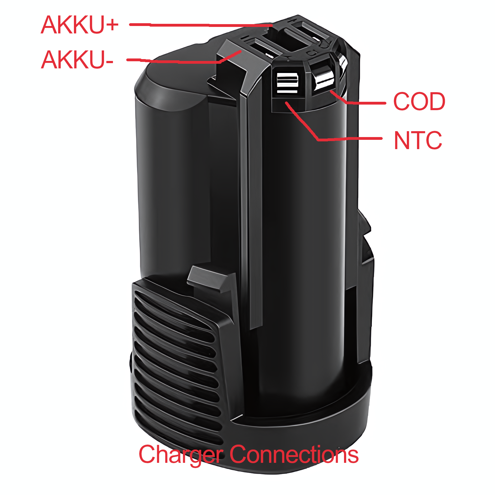

# Dremel-PCB1857V1

Reverse engineering of a Dremel 12v battery charger.
The pcb has the markings: PCB1857V1
This repository contains KiCad schematics of the main side of its power supply.
Component values have been measured and added.

## Battery

It is an open secret that Bosch and Dremel (Dremel being a division in the Robert Bosch Tool Corporation since 1993) batteries are compatible except for the bottom plastic shell with the retainment clips. If I had to take a wild guess I would say they are probably even manufactured in the same factory.

Even though the battery exposes two contacts for balance charging labeled C1 and C2 only C1 is connected to the charger. 

The kicker however is that inside the Bosch GSR BAT411 the both C1 and C2 are not actually connected to the batteries, as you can clearly see in the picture below:

Source: [BOSCH Upgrade Battery / Change Old Dead Li Ion Cell / GSR BAT411 - CMC DIY (youtube)](https://www.youtube.com/watch?v=-DkphFzir5k)

