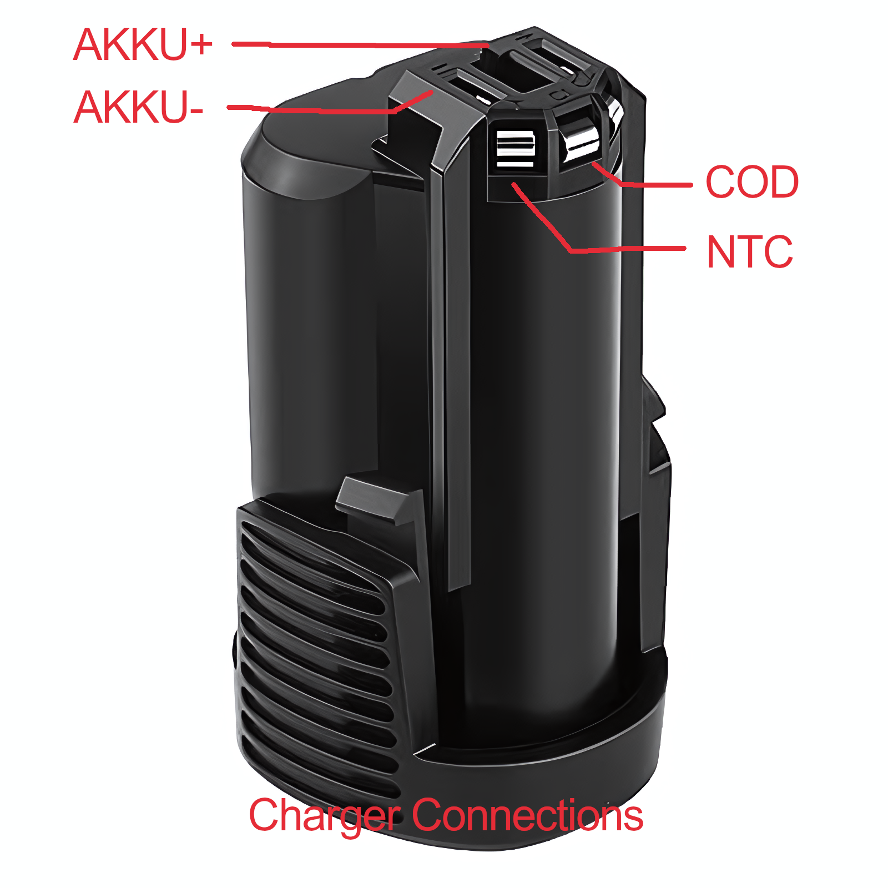
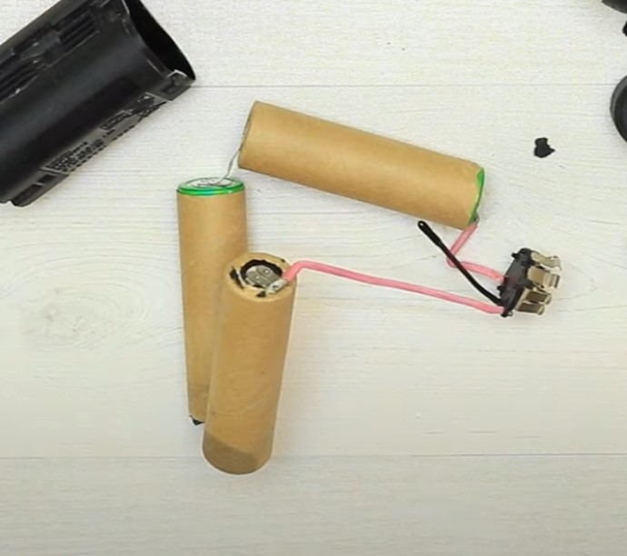
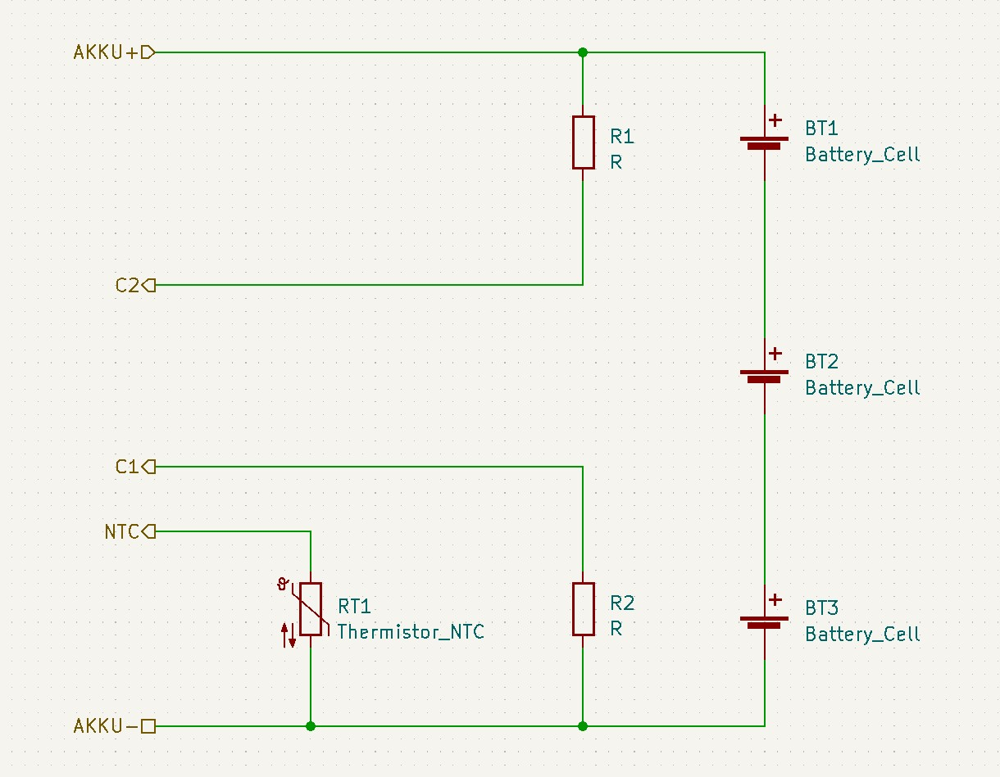

# Bosch/Dremel GAL 1215 CV repair

Reverse engineering and repair of a Dremel 12 V battery charger.
The pcb has the markings: PCB1857V1

The chargers specifications according to the manual:
voltage range: 1-3 cells, 3,6 - 12 V
max. charging current = 1500 mAh

## Reverse Engineering

## Proposed Working Principle

Beware, the following is simply my theory and is only supported by a couple measurements.
The charger circuit is clearly divided into two sections: The primary high voltage side of the smps and the secondary controller side. The secondary side has two supplies VDD and VCC. VCC powers the micro controller (uC, a custom jobby by ST-Microelectronics) and other ics. VDD is the battery voltage plus one forward voltage drop. When no battery is connected the VDD idles at 1,6 V and the VCC at 13 V. 

When a battery is detected by the micro controller the supply voltage is set to induce the desired charging current or constant voltage. 
The supply voltage is increased via the feedback path over the optocoupler U1. By increasing the photo-transistors c/e-resistance the Vbe of V1 is decreased which again increases Vgs of V5, letting current flow for a longer portion of a period in the switching cycle.

## Repair

### Damage report

### Failure theory 

### Fix

## Battery

It is an open secret that Bosch and Dremel (Dremel being a division in the Robert Bosch Tool Corporation since 1993) batteries are compatible except for the bottom plastic shell with the retainment clips. I would say that they are probably even manufactured in the same factory.

Even though the battery exposes two contacts for balance charging labeled C1 and C2 only C1 is connected to the charger. 

The kicker however is that inside the Bosch GSR BAT411 the both C1 and C2 are not actually connected to the batteries. I have confirmed myself that this is also the case for  See the picture below:

  
Source: [BOSCH Upgrade Battery / Change Old Dead Li Ion Cell / GSR BAT411 - CMC DIY (youtube)](https://www.youtube.com/watch?v=-DkphFzir5k)

From what I could gather from some pictures online the internal connections look like this:

  

Why could this be a problem?  

The connections to the individual battery cells are required for balance charging.
Due to manufacturing variations the internal resistance $R_1$, $R_2$ of two cells can vary. When the battery is discharged a current $I$ is flowing through all cells equally due to Kirchhoff's current law. This causes the voltages of the individual cells to decrease according to  

$$
\begin{align*}
    U_1 = R_1 \cdot I  \\
    U_2 = R_2 \cdot I
\end{align*}
$$

Resulting in a voltage difference of  

$$
\begin{align*}
    \Delta U = U_1 - U_2 
\end{align*}
$$

When the battery gets charged again this difference would get annihilated if the resistances were constant, but they are not. Over many discharge/charging cycles $\Delta U$ can grow to be a substantial difference which could cause the battery to fail because:  
a) One cell get under discharged, or  
b) the other cell gets overcharged.